# bandit-# OverTheWire Bandit Write-ups


## Introduction

This repository contains personal write-ups and learning notes from the **OverTheWire Bandit Wargame**.

Levels **0 to 15** are covered here as part of a hands-on cybersecurity learning journey. These challenges build practical knowledge of Linux command-line operations, SSH, file handling, permissions, text processing, encoding, compression, networking, and basic security concepts.

Each level below includes the commands used, an explanation of *why* they work, and a screenshot of the actual terminal session.

---

## About OverTheWire Bandit

**Bandit** is a beginner-friendly wargame from **OverTheWire** designed to teach Linux and security fundamentals through hands-on challenges. Each level gives you a password that lets you SSH into the next level, usually by exploiting a small quirk in files, permissions, or tools.

Connect with:
```bash
ssh bandit0@bandit.labs.overthewire.org -p 2220
```

---

## Levels Completed

### Level 0 → 1 — SSH connection
**Concept:** Basic SSH login.
```bash
ssh bandit0@bandit.labs.overthewire.org -p 2220
cat readme
```
The password for the next level is sitting in a file called `readme` in the home directory. `cat` just prints it.

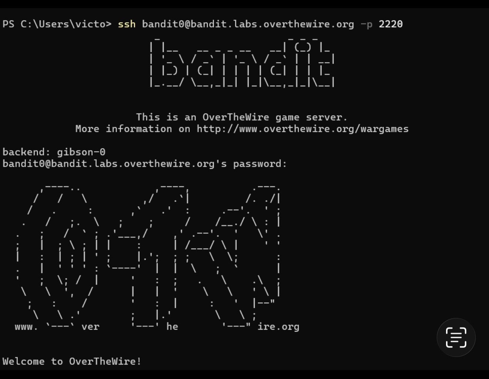
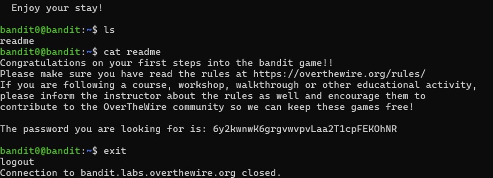

---

### Level 1 → 2 — Special filename
**Concept:** Handling filenames that look like flags.
```bash
cat ./-
```
The file is literally named `-`, which a shell normally reads as "read from stdin." Prefixing it with `./` tells `cat` to treat it as a relative path instead.

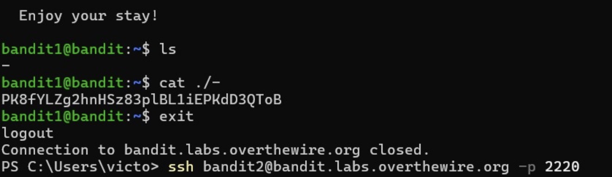

---

### Level 2 → 3 — Spaces in filenames
**Concept:** Filenames containing spaces.
```bash
cat "--spaces in this filename--"
```
Quoting keeps the shell from splitting the name into multiple arguments.

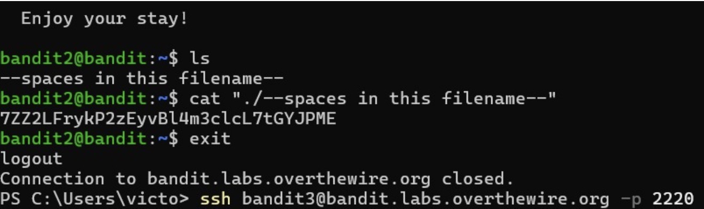

---

### Level 3 → 4 — Hidden files
**Concept:** Dotfiles.
```bash
cd inhere
ls -la
cat "...Hiding-From-You"
```
`ls` hides files starting with `.` by default; `-a` reveals them.

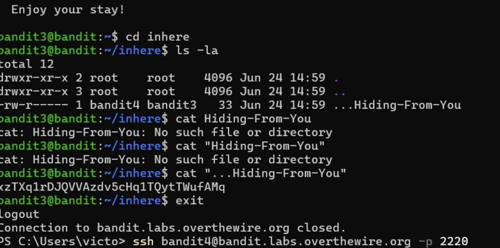

---

### Level 4 → 5 — Human-readable files
**Concept:** Identifying file types among decoys.
```bash
cd inhere
file ./*
cat ./-file07
```
Several files exist but only one is ASCII text. `file` reports the type of each so you don't have to `cat` them all blindly.

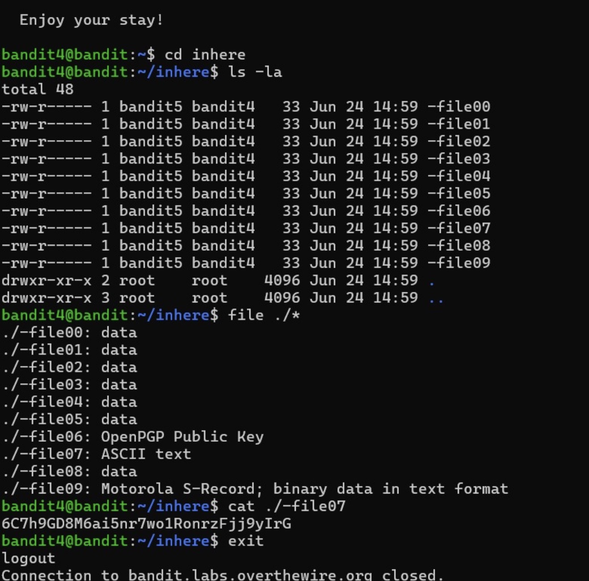

---

### Level 5 → 6 — Finding files by size and permissions
**Concept:** `find` with multiple filters.
```bash
find . -type f -size 1033c ! -executable
cat ./maybehere07/.file2
```
Combines file type, exact byte size, and permission filters to isolate one file out of a big directory tree.

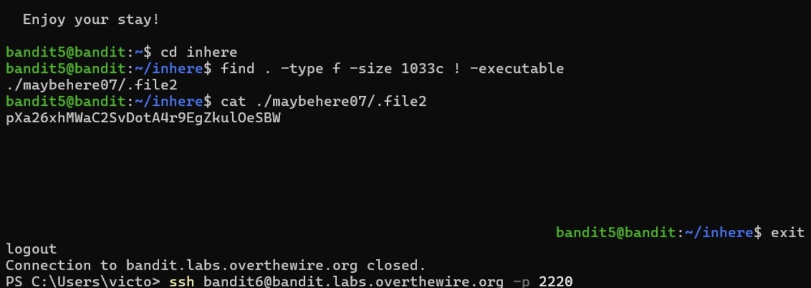

---

### Level 6 → 7 — File ownership and permissions
**Concept:** Searching the whole filesystem for owned, sized files.
```bash
find / -user bandit7 -group bandit6 -size 33c 2>/dev/null
cat /var/lib/dpkg/info/bandit7.password
```
Redirecting stderr (`2>/dev/null`) hides the flood of "Permission denied" noise from directories you can't read.

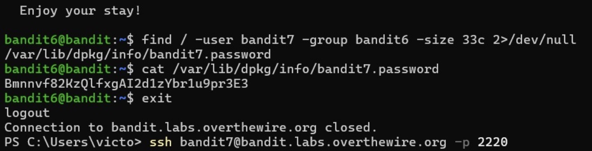

---

### Level 7 → 8 — Searching text with a keyword
**Concept:** `grep` for a marker word.
```bash
grep millionth data.txt
```
The password sits on the line next to a specific keyword in a large data file.

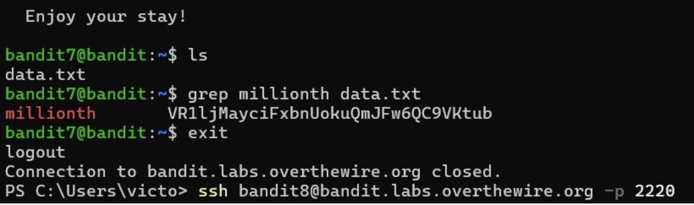

---

### Level 8 → 9 — Unique lines
**Concept:** Finding the line that appears only once.
```bash
sort data.txt | uniq -u
```
Sorting groups duplicate lines together so `uniq -u` can print only the one line with no duplicates.

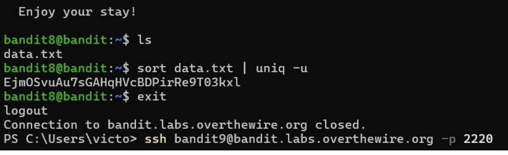

---

### Level 9 → 10 — Extracting readable strings
**Concept:** Pulling text out of a binary/data file.
```bash
strings data.txt | grep "="
```
`strings` extracts printable sequences from otherwise unreadable binary data; a pattern filter narrows down the result to the password line.

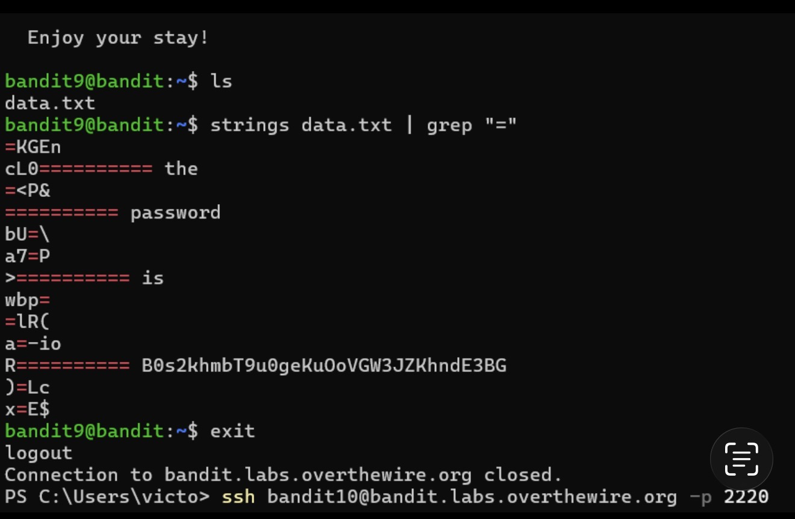

---

### Level 10 → 11 — Base64 decoding
**Concept:** Decoding an encoded password.
```bash
base64 -d data.txt
```
Straightforward decode of a Base64-encoded string.

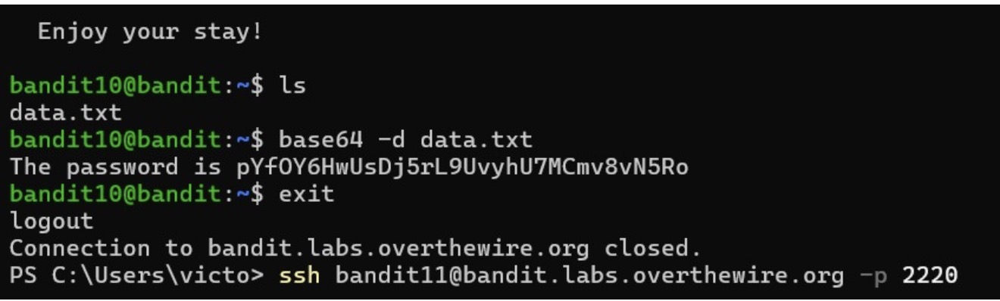

---

### Level 11 → 12 — ROT13
**Concept:** Simple substitution cipher.
```bash
tr 'A-Za-z' 'N-ZA-Mn-za-m' < data.txt
```
`tr` remaps each letter 13 places forward, which both encodes and decodes ROT13 since it's symmetric.

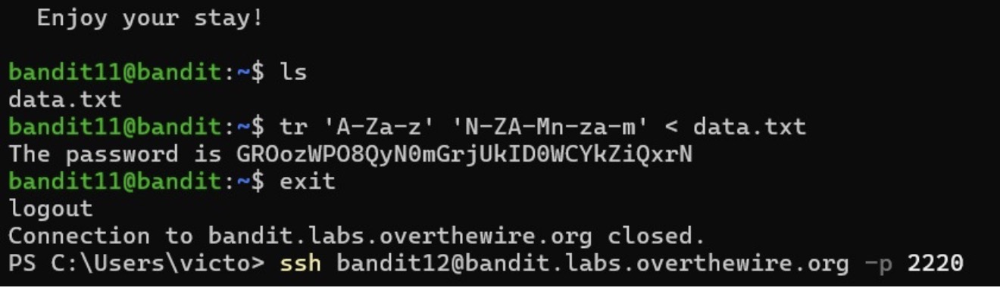

---

### Level 12 → 13 — Hexdump and repeated compression
**Concept:** Reconstructing and decompressing a layered archive.
```bash
mkdir /tmp/12 && cp data.txt /tmp/12/ && cd /tmp/12
file data.txt
xxd -r data.txt data
file data          # repeat: check type, rename, decompress
mv data data.gz && gunzip data.gz
file data          # -> bzip2
bunzip2 data
file data.out       # -> gzip again
mv data.out data && mv data data.gz && gunzip data.gz
file data          # -> tar
tar -xf data
tar -xf data5.bin
bunzip2 data6.bin
tar -xf data6.bin.out
mv data8.bin data8.gz && gunzip data8.gz
cat data8
```
The file is a hex dump of data that's been compressed multiple times with different tools (gzip, bzip2, tar...). `file` is used after each step to identify what compression to undo next, since the chain of formats is randomized per session.

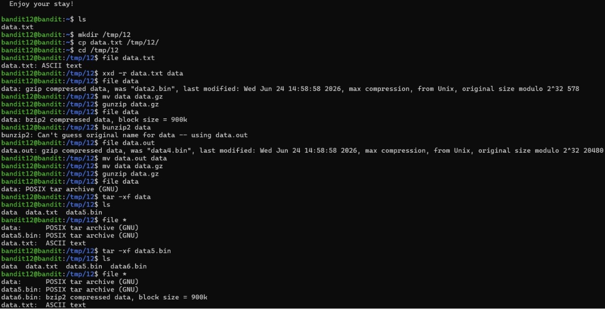
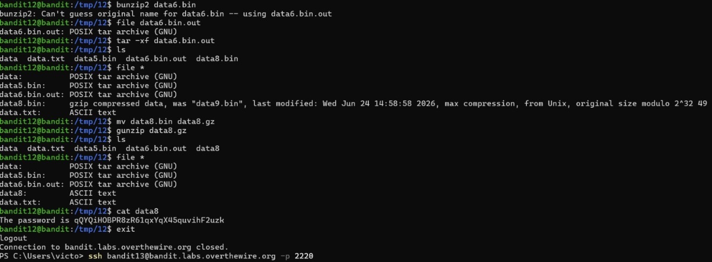

---

### Level 13 → 14 — Using an SSH private key
**Concept:** Key-based authentication instead of a password.
```bash
file sshkey.private
# from local machine:
scp -P 2220 bandit13@bandit.labs.overthewire.org:/home/bandit13/sshkey.private .
ssh -i sshkey.private bandit14@bandit.labs.overthewire.org -p 2220
```
The private key is copied out to the local machine with `scp`, then used with `ssh -i` to log in as `bandit14` directly, without needing a password.

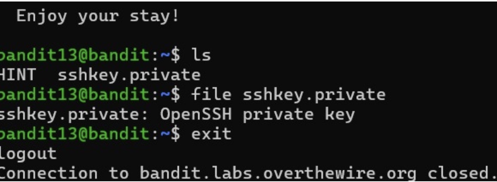
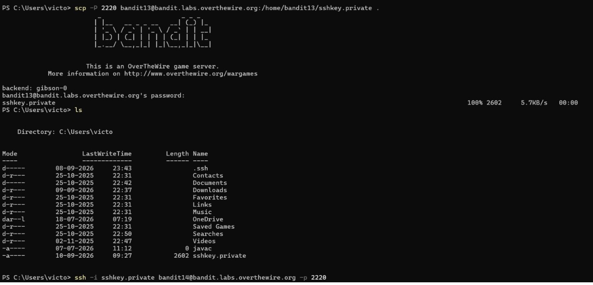

---

### Level 14 → 15 — Talking to a local port
**Concept:** Submitting data over a raw TCP connection.
```bash
cat /etc/bandit_pass/bandit14
nc localhost 30000
```
A service listens on a local port and hands back the next password when it receives the current level's password as input.

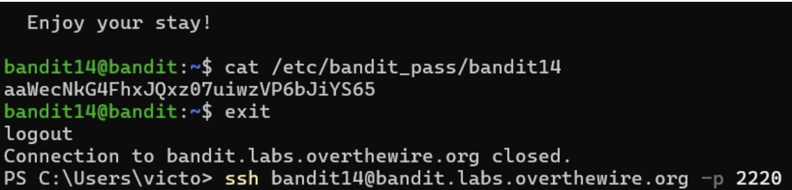
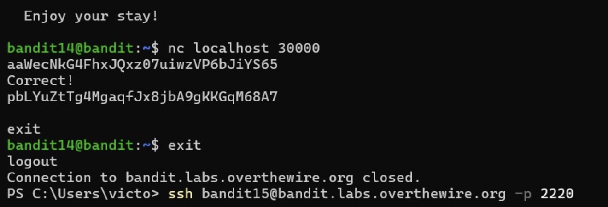

---

### Level 15 → 16 — SSL/TLS connection
**Concept:** Talking to a port that requires encryption.
```bash
openssl s_client -quiet -connect localhost:30001
```
Plain `nc` can't speak TLS, so `openssl s_client` is used to open an encrypted connection; pasting in the current password returns the next one.

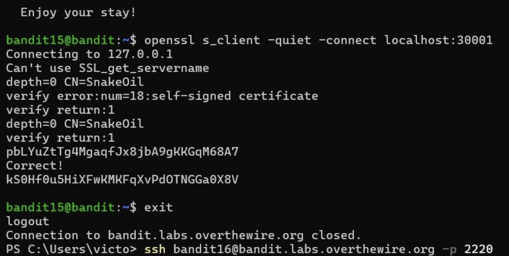

---

## 📊 Progress

**16 / 34 Levels Completed** 🎯

```
████████████████░░░░░░░░░░░░░░░░░░ 47%
```

## 🏆 Milestones

- 🟢 **Levels 1–5** — Completed
- 🟢 **Levels 6–10** — Completed
- 🟢 **Levels 11–15** — Completed
- 🟢 **Level 16** — Completed
- ⚪ **Levels 17–20** — Upcoming
- ⚪ **Levels 21–25** — Upcoming
- ⚪ **Levels 26–30** — Upcoming
- ⚪ **Levels 31–34** — Final Mission

## 🎯 Goal

Complete all **OverTheWire Bandit** levels and document the commands, techniques, and cybersecurity concepts learned throughout the journey.

## Notes

- Exact commands and filenames can vary slightly between playthroughs since some levels (e.g. Level 12) generate randomized file/compression chains per user session — the *approach* stays the same even if file names differ.
- These write-ups are for learning purposes on OverTheWire's official practice environment, which is explicitly built for this kind of walkthrough.
